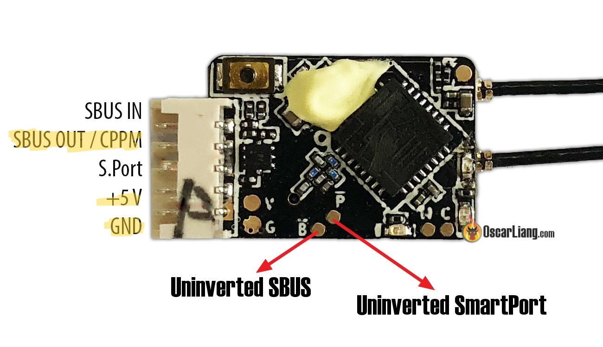
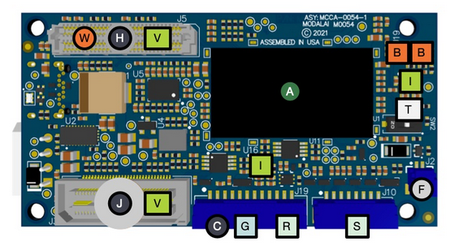
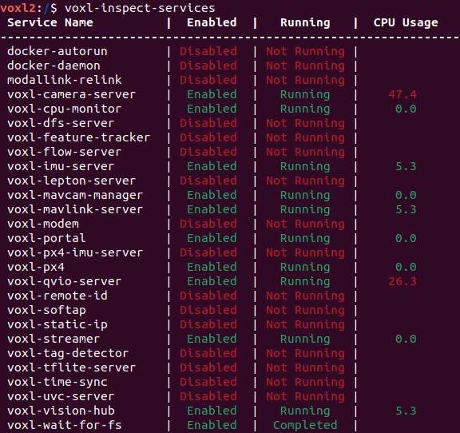
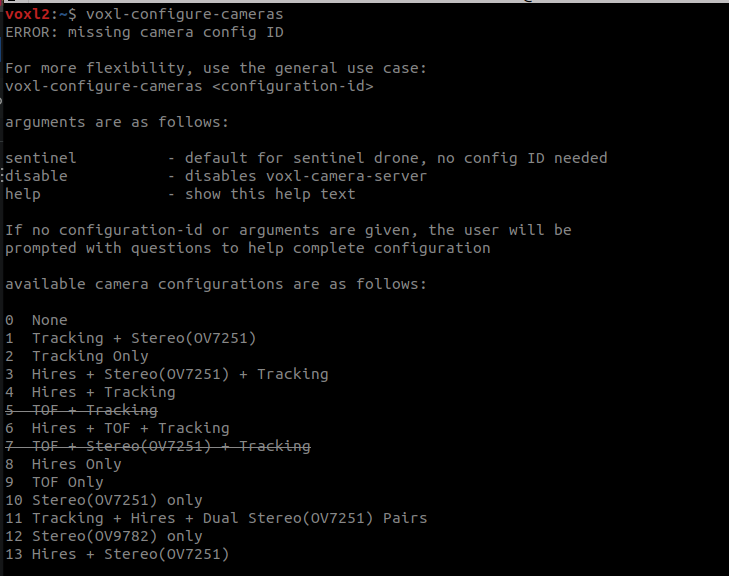
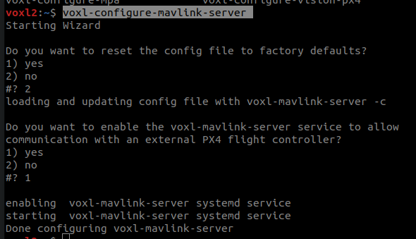
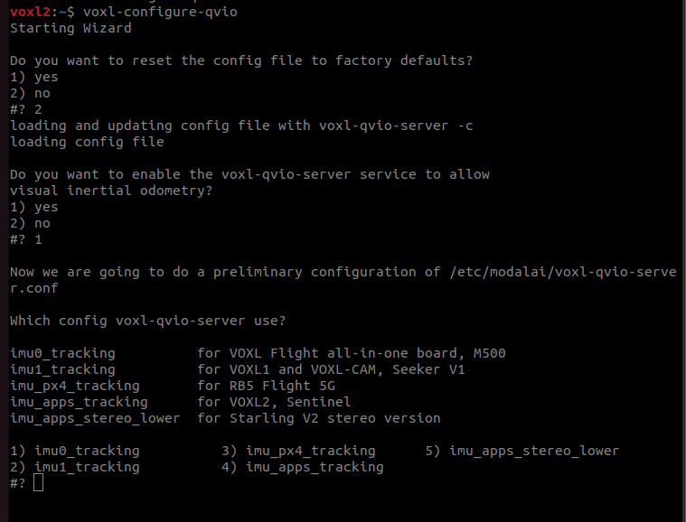
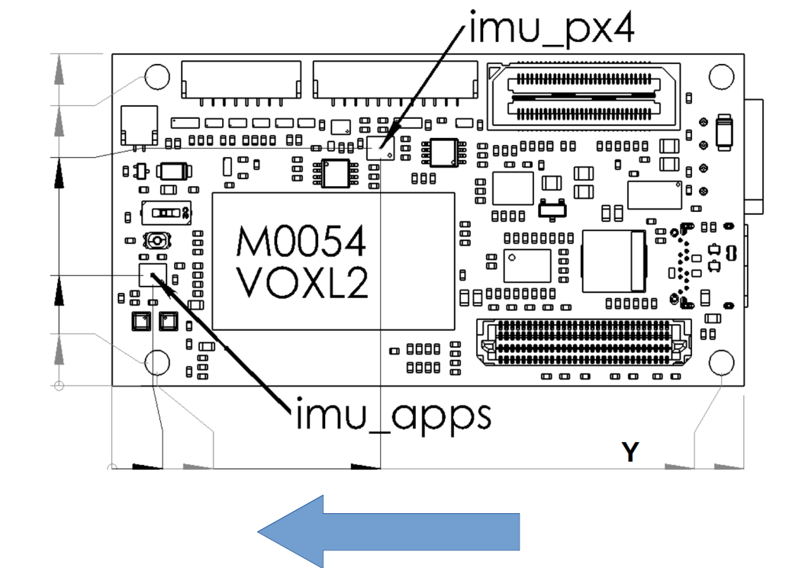

Introduction
======================

This documentation explains the needed process and configuration of VOXL2 to set up. This document will explain the hardware and software aspects and the required changes that must be done in the software.

Hardware
======================

The hardware for VOXL2 has several components such as the tracking camera, the stereo cameras, and ESC. In this section, I will explain the required hardware components.

The voxl2 has several add-ons that we may need to purchase, and they are the following:

* Cooling [Fan](https://www.google.com/url?q=https://www.modalai.com/products/voxl-cooling-fan&sa=D&source=editors&ust=1691917601980257&usg=AOvVaw0hOY-yRoiztNGqEsESiYbP).
* [GPS](https://www.google.com/url?q=https://www.modalai.com/products/voxl-2-gps-mag-rc-assembly?variant%3D40673762836531&sa=D&source=editors&ust=1691917601980698&usg=AOvVaw3tfBu6sQQo0tFT_pKoe6jU).
* I/O [board](https://www.google.com/url?q=https://www.modalai.com/products/voxl2-io?variant%3D40610514206771&sa=D&source=editors&ust=1691917601981044&usg=AOvVaw1DFfFlaaBg56q5IEse0KOW).
* [ESC](https://www.google.com/url?q=https://www.modalai.com/products/voxl-esc?variant%3D44353436614960&sa=D&source=editors&ust=1691917601981331&usg=AOvVaw33TVmyNW2I-INwB6PZzbw5) 4-in-1.
* [Wifi Dongle](https://www.google.com/url?q=https://www.modalai.com/products/voxl-2-wifi-add-on-kit&sa=D&source=editors&ust=1691917601981590&usg=AOvVaw0KTldl8ukAP0LcHyFUDU-h).
* I/O board [connector](https://www.google.com/url?q=https://www.modalai.com/products/mcbl-00061&sa=D&source=editors&ust=1691917601981834&usg=AOvVaw2fToD1ajGZqOtmRHcQSVT3).
* FRsky receiver - X8R.

All the above components are compatible with VOXL2.

Connecting the Cameras
======================

The hardware starts with connecting the Tracking camera and stereo cameras to [VOXL](https://www.google.com/url?q=https://docs.modalai.com/voxl-2-hardware-quickstart/&sa=D&source=editors&ust=1691917601982366&usg=AOvVaw1NVy54dNISE14CUiGbccJm)as it is shown in the document [here](https://www.google.com/url?q=https://docs.modalai.com/voxl2-power/&sa=D&source=editors&ust=1691917601982559&usg=AOvVaw1B83XXeCS8IXab6SUFBw-s).

Connecting the Wifi Dongle
==========================

VOXL2 does not come with a WiFi dongle; we need to order one. The documentation for the wifi is shown [here](https://www.google.com/url?q=https://docs.modalai.com/voxl2-wifidongle-user-guide/&sa=D&source=editors&ust=1691917601982940&usg=AOvVaw0UrWnOXa9SZqJyrsMNL-y9).

Connecting the ESCs
===================

For the ESC, there are two ways to connect them to VOXL2:

1.  Using VOXL2 ESC 4-in-1.

If we use the VOXL2 ECS 4-in-1, we can connect it directly to the VOXL2 and we don’t need to connect to the I/O board. We can see the documentation [here](https://www.google.com/url?q=https://docs.modalai.com/voxl2-esc-configs/&sa=D&source=editors&ust=1691917601983489&usg=AOvVaw05HmBkxMNzFaGE2j2Slrvu).

2.  Using individual ESCs for each motor.

For the individual ESCs, we need to connect them to the I/O board, we can use the I/O board datasheet [here](https://www.google.com/url?q=https://docs.modalai.com/voxl2-io-datasheet/&sa=D&source=editors&ust=1691917601983889&usg=AOvVaw3jk3-UhiJHsL2lxZsg9wd-) for the connection. The I/O board has three main ports; PWM (For the ESCs), S-Bus (For the RC receiver), and the connection port between the VOXL2 and the I/O board. For the connection of the ESCs to the PWM output, we connect the signal wires in order to the PWM output and connect the ground cables of the ECSs in a single wire, then connect it to the PWM port.

The overall connection for the individual ESCs to the [I/O board](https://www.google.com/url?q=https://docs.modalai.com/voxl2-io-user-guide/&sa=D&source=editors&ust=1691917601984153&usg=AOvVaw3rU-5z6-jmlBYQQVu7nVWS) is shown in figure (1) below:

Figure (1) - The overall connection for the individual ESCs to the I/O board.

For more details, [here](https://www.google.com/url?q=https://docs.modalai.com/voxl2-io-datasheet/&sa=D&source=editors&ust=1691917601984674&usg=AOvVaw1d8Te8u3gIFHX8-8xPdAOI)and [here](https://www.google.com/url?q=https://docs.modalai.com/voxl2-io-user-guide/&sa=D&source=editors&ust=1691917601984868&usg=AOvVaw3N0j5_qRGm1vCOHfpTbgPH).

Connecting the RC Receiver:
===========================

The VOXL2 board does not support all types of RC receivers, there are specific types of receivers that can be connected directly to VOXL2 such as Spektrum and Graupner. For more detailed information, we can check the link [here](https://www.google.com/url?q=https://docs.modalai.com/voxl2-rc-configs/&sa=D&source=editors&ust=1691917601985210&usg=AOvVaw2y0N1db4W-bc0E_b8RUdUQ). To use the FrSky receiver, we need to consider two things.

* Not all FrSky receivers are compatible with VOXL2.
* We need an I/O board.

The FrSky receiver is connected to the I/O board through the S-Bus port. The VOXL2 supports only (FrSky R-XSR), where it has an SBUS Output port that connects to the I/O board. We can see the FrSky R-XSR receiver and the port in figure (2) below:

Figure (2) - FrSky R-XSR receiver

        We can see the pinout for the SBUS port in the I/O board (left) and the connection of the receiver to the I/O board (Right) in the figure (3) below:

Figure (3) - the pinout for the SBUS port in the I/O board and the connection of the receiver to the I/O board

        From the figure 2 above, we can see that we connect the SBUS Input in the I/O board to the SBUS Output in the FrSky receiver.

To connect the RC transmitter, we need to make sure that the receiver and the transmitter are in the same channel, either ACCST or ACCESS.

Connecting the RC GPS:
======================

The VOXL2 does not come with a magnetometer, so we need to connect a GPS to it, where we need to do the calibration process in the QGC. The GPS is connected to the same port that the I/O board is connected to, and we can connect it as shown in the documentation [here](https://www.google.com/url?q=https://docs.modalai.com/voxl2-guides-onboard-offboard-sensors/&sa=D&source=editors&ust=1691917601986509&usg=AOvVaw0QBVI7pJ4EVcdZnKPYISdi).

Connecting the Cooling Fan:
===========================

        We need to order the fan to cool the processor, and it is connected to the (F) port as shown in Figure (3) below. 

Figure 3 - VOXL2 Ports.

Connecting The Power Input
==========================

To power up VOXL2, we can see the documentation [here](https://www.google.com/url?q=https://docs.modalai.com/voxl2-power/&sa=D&source=editors&ust=1691917601987227&usg=AOvVaw12jxUXsHA8lt2SBo7z6DLG). The required voltage input for VOXL2 is shown in figure (4)  below:

Figure (4) - VOXL2 input voltage.

Software

After connecting all the hardware components, we can start with the software part. This section will explain the software aspects from accessing VOXL2 to the configurations for the hardware components and the QGC calibration. These two documentations [here](https://www.google.com/url?q=https://docs.modalai.com/voxl-developer-bootcamp/&sa=D&source=editors&ust=1691917601987844&usg=AOvVaw1EabXEfosOGBnppsHqMz1A)and [here](https://www.google.com/url?q=https://docs.modalai.com/voxl-sdk/&sa=D&source=editors&ust=1691917601988072&usg=AOvVaw1WUKuFHPnutHxotRiqJNLQ) are good points to start with, and reading it.

Access VOXL2 Shell for The First Time
=====================================

To access VOXL2 for the first time, we can access it by using ADB (Android Debug Bridge), and we need to install it first in the workstation. Then, we connect the USB C to VOXL2 and power up VOXL2, it has to be in this order.

The installation for the ADB on Ubuntu can be seen in this [documentation](https://www.google.com/url?q=https://docs.modalai.com/setting-up-adb/&sa=D&source=editors&ust=1691917601988524&usg=AOvVaw0s_UmEc5tDdj70QNUygboE). After, installing the ADB, we can access VOXL2 by the below command:

adb shell

The Wifi Dongle Configuration
=============================

We can enable the wifi to VOXL2 and connect to the WiFi by the command line below: 

Voxl-wifi station ssid passward

We can type the wifi name under (ssid) and wifi’s password and it will connect to the WiFi. For more information, we can read the documentation [here](https://www.google.com/url?q=https://docs.modalai.com/voxl-2-wifi-setup/&sa=D&source=editors&ust=1691917601989722&usg=AOvVaw32EKgfkzfJxdpviKpNm_5u). To test if VOXL2 is connect to                   the internet, we can use the command below:

ping google.com

Access VOXL2 with SSH
=====================

We can follow the below steps:

1- Check VOXL2 IP address:

ifconfig

2- Start connecting to VOXL2 using ssh from the workstation:

ssh root@VOXL2\_IP\_Address

3- VOXL2 default password:

oelinux123

VOXL2 Services
==============

At this point, we can access VOXL2 easily by using the ssh. Now we need to enable some options (services) that are pre-installed in VOXL2. To check these services, we need to do the following:

voxl-inspect-services -v

        Figure (5) below shows the services that VOXL2 provides.

Figure (5) - VOXL2 Services.

From figure (5) above, we need to enable the following services;

* Voxl-camera-server
* Voxl-mavlink-server
* Voxl-portal
* Voxl-px4-imu-server
* Voxl-imu-server
* Voxl-px4
* Voxl-qvio-server
* Voxl-vision-px4

We can enable/configure each service by the commands below:

voxl-configure-cameras - To set up the cameras

voxl-configure-cpu-monitor - to enable the cpu monitor

voxl-configure-portal - to enable the portal to access the camera from the browser

Voxl-configure-imu

Voxl-configure-mavlink-server

Voxl-configure-px4-imu-server

Voxl-configure-qvio

Voxl-configure-vision-px4

voxl-configure-extrinsics

VOXL2 Portal Configuration
==========================

To enable the postal service, where we can view the cameras’ output, CPU and IMU plotting, flight info, and the VIO from the browser. We can access it with the VOXL2 IP address. To enable this service, we can use the following command:

voxl-configure-portal

        Figure (6) below shows the command output.

Figure (6) - VOXL2 Portal Command Output.

For more information, we can see this [documentation](https://www.google.com/url?q=https://docs.modalai.com/voxl-portal/&sa=D&source=editors&ust=1691917601995007&usg=AOvVaw0pejT3IPP5eKpnWQw8tSRf).

VOXL2 Camera Configuration
==========================

To set the available cameras on the VOXL2, we need to run the following command below:

voxl-configure-cameras

The Figure (7) below shows the command output:

Figure (7) - VOXL2 Camera configuration command output.

From Figure (7) above, we can see a list of cameras set up, we can select the one we have. In our case, we select the set number 11. We run the same command above and we specify the cameras’ set-up ID, which is 11.

Camera Calibration                                                                
----------------------------------------------------------------------------------

After configuring the cameras, we can start the calibration process by the command below:

voxl-calibrate-camera

* Note: The calibration process has to be done in normal light brightness, and the calibration process can be done within the portal. For more information, we can check this [documentation](https://www.google.com/url?q=https://docs.modalai.com/calibrate-cameras-0_9/&sa=D&source=editors&ust=1691917601997094&usg=AOvVaw0-2CijSzMBHVWKYL76imMy).

VOXL2 Connection to QGC
=======================

To connect VOXL’s PX4 to the QGC, we need to start with enabling the \[voxl-mavlink-server\],  \[voxl-px4\] & \[voxl-vision-px4\] services.

A- Enable Mavlink:

        Command: voxl-configure-mavlink-server

     Figure (8) below shows the command output.

Figure (8) - Mavlink Service configuration Output

B- Enable Px4 IMU

Command: voxl-configure-px4-imu-server

            Figure (9) below shows command output.

Figure (9) - PX4 IMU configuration command output.

C- Enable vision PX4

        In this step, I can choose the IP address for the workstation to run the QGC at by using the command below:

voxl-configure-vision-px4

        Now, we can open QGC on the workstation, and we will see VOXL2 is connected to it.

VOXL2 VIO Configuration
=======================

        To configure the VIO, we can use the command below:

 voxl-configure-qvio

Figure (10) below shows the command output.

Figure (10) - VIO Configuration command output.

Note: We need to use/select the IMU for the VOXL2

VOXL2 Extrinsics Configuration
==============================

The Extrinsics file is a file that describes the intrinsics (i.e. translations and rotations) between the coordinate frames of critical components of the drone body, the [documentation](https://www.google.com/url?q=https://www.google.com/search?channel%3Dfs%26client%3Dubuntu-sn%26q%3Dvoxl%2B2%2Bextrinsics&sa=D&source=editors&ust=1691917601999860&usg=AOvVaw10xWW4bo5RnfIFmwlqsgQQ). We can configure it by using the command below:

Voxl-configure-extrinsics

    Figure (11) below shows the command output:

Figure (11) - Extrinsics command output.

We will select the custom option, and select the path with the extrinsics.conf. We can create a custom file similar to the one on the path \[/etc/modalai/extrinsics.conf\] on the VOXL2 system. The one that we made for the VOXL2 extrinsics, can be seen [here](https://www.google.com/url?q=https://drive.google.com/file/d/17fY-u9_cFl2jo-a1hwfjprNAHy-Qfas_/view?usp%3Dsharing&sa=D&source=editors&ust=1691917602000854&usg=AOvVaw0G_LvhQCGOM2deJrSLHxct).

To check the loaded extrinsics file on the configuration, we can use the following command:

voxl-inspect-extrinsics

VOXL2 Orientation:
==================

The front orientation for VOXL2 is shown in figure (12) below with the arrow is the front direction:

Figure (12) - The Front Orientation for VOXL2.

So, if we need to change the orientation, the IMU driver needs to know the changes. To do so, we need to open a code file in the following path:

/etc/modalai/voxl-px4.config

        We need to change the values on the below lines:

qshell icm42688p start  -s -R

If we rotate VOXL2 180 degrees Roll, we need to change the number to \[8\], and If we rotate VOXL2 180 degrees Yaw, we need to change the number to \[4\]. Figure (13) below shows the changes in code with the orientation rotate 180 degree Yaw.

Figure (13) - The Changes in the code with a rotation 180-degree Yaw.

* Note: We don’t need to change the orientation on the QGC.

VOXL2 GPS Orientation
=====================

For the GPS orientation, if the arrow on the GPS is pointing forwards, we don't need to change anything. Otherways, we need to change the values on the code in the path \[/etc/modalai/voxl-px4.config\]. For the GPS & magnetometer in a Holybro GPS unit t,he rotation is specified as 10 (roll 180, yaw 90) when the unit is mounted on the drone with the arrow pointing towards the front of the drone. If you reverse this and the arrow points to the rear of the drone then you would specify 14 (roll 180, yaw 270).

        The changes in the code file in the path \[/etc/modalai/voxl-px4.config\], and the changes are in figure (14) below line:

Figure (14) - The Code Changes for the GPS orientation.

VOXL2 ESCs Calibration
======================

To calibrate the ESCs, we need to run the following command:

px4-qshell pwm cal_backdoor

For more information, we can check this [documentation](https://www.google.com/url?q=https://docs.modalai.com/voxl2-io-user-guide/&sa=D&source=editors&ust=1691917602004620&usg=AOvVaw3eoEON33p8GS-31UA3Gt9M).

To test the motors, we can run the following command.

px4-qshell pwm test -c 2 -p 1200

VOXL2 Calibration with QGC
==========================

We can do the calibration through the QGC normally.

VOXL2 ROS & MavROS:
===================

        In this section, we will be able to install ROS Melodic on VOXL2. Also, we are going to run the MAVLink package. We can follow the steps below:

1.  Install ros (melodic):

We can run the following command, and after installing ROS, we can source

apt install -y ros-melodic-ros-base ros-melodic-image-transport

Then, we can source (. /opt/ros/melodic/setup.sh) in (.bashrc)

2.  Publish the topics:  
    

At this point, ROS is running in VOXL2, and we need to publish the topics from the VOXL2. We can run the following launch file:

roslaunch voxl\_mpa\_to\_ros voxl\_mpa\_to\_ros.launch

3.  Run the mavros:

        To run the MavRos, we can run the following script, in the following path:

cd /home/mavros_test &&

        Then, we can run the following script:

./run_mavros.sh

        Now, MavROS is running, and the topics are published.

Rviz on The workstation:
========================

        To be able to see the topics on the workstation, we can run the following commands:

On the Workstation:

export ROS_IP=Station_IP && export ROS\_MASTER\_URI=http://VOXL2_IP:11311

On the VOXL2:

export ROS_IP=VOXL_IP && export ROS\_MASTER\_URI=http://VOXL_IP:11311

        We just need to change the IP addresses on the above commands.

Test the services & Hardware:
=============================

We can inspect the services as shown in the [documentation](https://www.google.com/url?q=https://docs.modalai.com/basic-functionalities/&sa=D&source=editors&ust=1691917602010029&usg=AOvVaw06dJHL1Rv5Zn7-XWZ4oB_B).

To Listen to the sensors from PX4, we can do the following:

px4-listener sensor_gps (GPS)

px4-listener sensor_mag (Magnetometer)

px4-listener sensor_accel

px4-listener sensor_gyro

px4-listener sensor_baro

px4-listener battery_status

px4-listener input_rc

px4-listener esc_status

Conclusion

In this documentation, I showed the procedure of how to work with VOXL2 on the hardware side and the software as well. We can follow this documentation in the future with the new VOXL2, and we will be able to work with it and run it in less time than took us in the first VOXL2.  

Useful Links:

* [https://forum.modalai.com/topic/1914/changing-voxl2-dsp-px4-orientation/3](https://www.google.com/url?q=https://forum.modalai.com/topic/1914/changing-voxl2-dsp-px4-orientation/3&sa=D&source=editors&ust=1691917602012269&usg=AOvVaw3RD_JWxKDSA07Evf8npRvw)
* [https://forum.modalai.com/topic/2063/gps-not-working/2](https://www.google.com/url?q=https://forum.modalai.com/topic/2063/gps-not-working/2&sa=D&source=editors&ust=1691917602012607&usg=AOvVaw3P7PXxlJKekhXDR-JQl6Wx)
* [https://forum.modalai.com/topic/1914/changing-voxl2-dsp-px4-orientation](https://www.google.com/url?q=https://forum.modalai.com/topic/1914/changing-voxl2-dsp-px4-orientation&sa=D&source=editors&ust=1691917602012940&usg=AOvVaw3sdk60eiRmT9KqPKc27aPY)
* [https://forum.modalai.com/topic/1969/qgc-sensors-compass-remains-red/12?_=1686804976347](https://www.google.com/url?q=https://forum.modalai.com/topic/1969/qgc-sensors-compass-remains-red/12?_%3D1686804976347&sa=D&source=editors&ust=1691917602013281&usg=AOvVaw2_uwPhWK9SKaTBYfbUIMyg)
* [https://forum.modalai.com/topic/2073/voxl-2-esc-calibration-custom-motors-and-battery/5](https://www.google.com/url?q=https://forum.modalai.com/topic/2073/voxl-2-esc-calibration-custom-motors-and-battery/5&sa=D&source=editors&ust=1691917602013683&usg=AOvVaw0rRKfgzoAUrsCoPv0hIclF)
* [https://forum.modalai.com/topic/1183/propellers-not-spinning-calibration-issues/7](https://www.google.com/url?q=https://forum.modalai.com/topic/1183/propellers-not-spinning-calibration-issues/7&sa=D&source=editors&ust=1691917602014019&usg=AOvVaw1ajMKlK8HDtRrcbhqTvhEm)
* [https://gitlab.com/voxl-public/voxl-sdk/utilities/voxl-px4-params/-/blob/master/params/v1.14/EKF2\_helpers/indoor\_vio.params](https://www.google.com/url?q=https://gitlab.com/voxl-public/voxl-sdk/utilities/voxl-px4-params/-/blob/master/params/v1.14/EKF2_helpers/indoor_vio.params&sa=D&source=editors&ust=1691917602014401&usg=AOvVaw0kW2eSMX5SgwoxXN3kNqyd)
* [https://gitlab.com/voxl-public/voxl-sdk/utilities/voxl-px4-params/-/blob/master/params/v1.12/ekf2\_indoor\_vio.params](https://www.google.com/url?q=https://gitlab.com/voxl-public/voxl-sdk/utilities/voxl-px4-params/-/blob/master/params/v1.12/ekf2_indoor_vio.params&sa=D&source=editors&ust=1691917602014814&usg=AOvVaw35ZUGw9uQT_ZIYiMv9B0pf)
* [https://docs.modalai.com/mavros/#how-to-run-mavros](https://www.google.com/url?q=https://docs.modalai.com/mavros/%23how-to-run-mavros&sa=D&source=editors&ust=1691917602015112&usg=AOvVaw1eTCpv3Wq3q33YTCQk4b-D)
